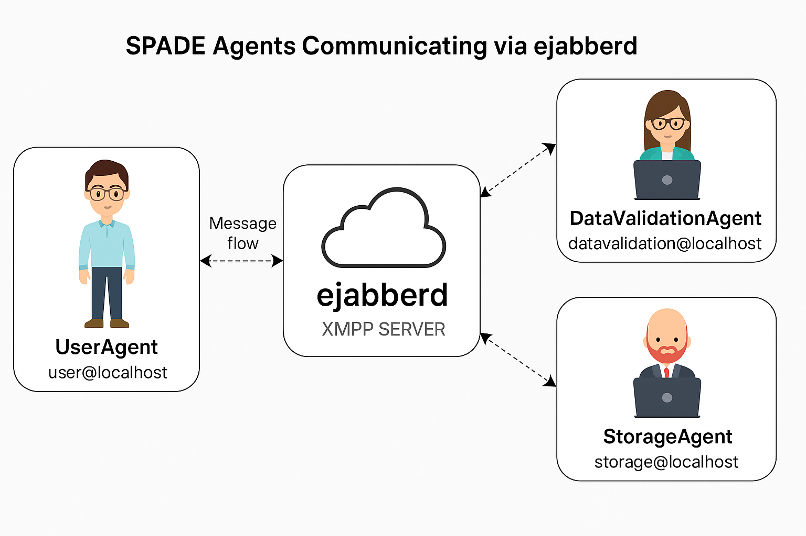
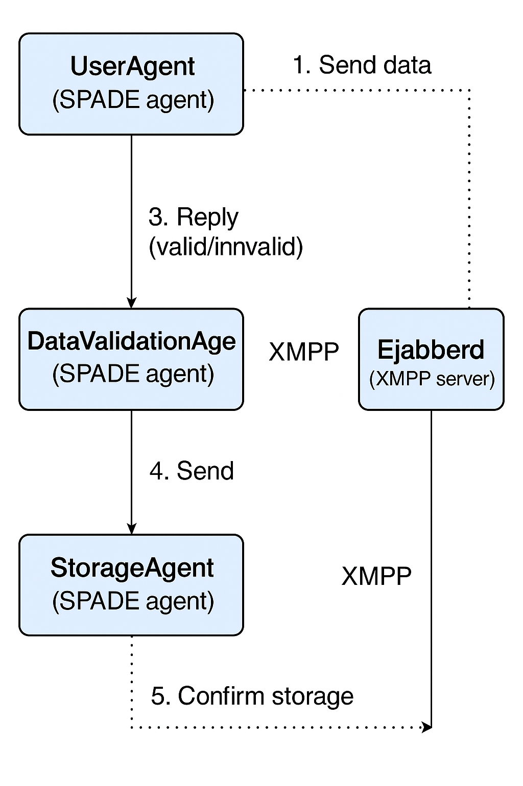

# Agent-Based Communication System with SPADE and ejabberd

## 📌 Project Summary

This project demonstrates a multi-agent system using SPADE (Smart Python Agent Development Environment) that communicates via an ejabberd XMPP server. It includes three core agents:

- **UserAgent**: Provides an interface for user input.
- **DataValidationAgent**: Validates the user data and ensures correctness.
- **StorageAgent**: Receives validated data and stores it.

---

## 📌 Project Structure

```plaintext
.
├── main.py                  # Entry point that starts all agents
├── useragent.py             # UserAgent takes input from user and sends it to DataValidationAgent
├── datavalidation_agent.py  # Validates incoming data
├── storage_agent.py         # Stores validated data
├── requirements.txt         # Python dependencies
├── README.md                # Project description and instructions
````

---

## 👥 Agents Overview

### 1. **UserAgent**

* Collects data from the user.
* Sends it to the DataValidationAgent.
* Optionally includes a desktop GUI built with Tkinter.

### 2. **DataValidationAgent**

* Validates the incoming data.
* Forwards validated data to the StorageAgent.
* Responds with errors if the input is invalid.

### 3. **StorageAgent**

* Receives validated data.
* Stores it (e.g., in a file or database).
* Sends a confirmation back (optional).

---

## 🧭 High-Level Communication Overview

This diagram provides a visual overview of how agents interact with each other through the ejabberd XMPP server.



## 🔁 Detailed Communication Flow

The following diagram shows the detailed message-passing steps between agents in your system:



## 👥 Agents Overview

### UserAgent
- Role: Accepts input from the user (GUI/console).
- Sends input to the `DataValidationAgent`.

### DataValidationAgent
- Role: Validates input data.
- If valid, forwards it to `StorageAgent`. Otherwise, responds with an error.

### StorageAgent
- Role: Stores the validated data into a storage backend or log.

## 📡 Communication Flow

1. **UserAgent** sends input data to `DataValidationAgent`.
2. `DataValidationAgent` checks the data:
   - If valid → sends to `StorageAgent`
   - If invalid → replies to `UserAgent` with an error
3. `StorageAgent` stores the data and optionally sends an acknowledgment.

## ⚙️ Technologies

- SPADE 4.0.0
- ejabberd (XMPP server)
- Python 3.12
- Docker
- Docker Compose
- Optional GUI via `tkinter`

---

## Local setup
```bash
git clone https://github.com/raufur-simanto/Multi-Agent-Communication-With-SPADE.git
cd agent-based-communication-system
```
## 🚀 How to Run

### 1. Set up ejabberd server by running the following commands:
```bash
docker-compose -f xmpp.yaml up -d
```

* Run ejabberd and create accounts for:
  * Go to ejabberd ui by http://localhost:5280/admin/ and sign in with `admin`
  * Create accounts for:
  * `user@localhost`
  * `datavalidation@localhost`
  * `storage@localhost`

### 2. Install dependencies

```bash
pip install -r requirements.txt
```

### 3. Run the project

```bash
python main.py
```

> If you're using the GUI version of the UserAgent, make sure your environment supports Tkinter.

---

## 📦 Requirements

See `requirements.txt`:

```txt
spade==4.0.0
tkinter      # Included in standard Python installations
```

---

## 📝 Author

* Raufur | MSc Artificial Intelligence, University of Jyväskylä

---

## 📄 License

This project is for academic purposes. Feel free to modify and build upon it for personal or educational use.

```
